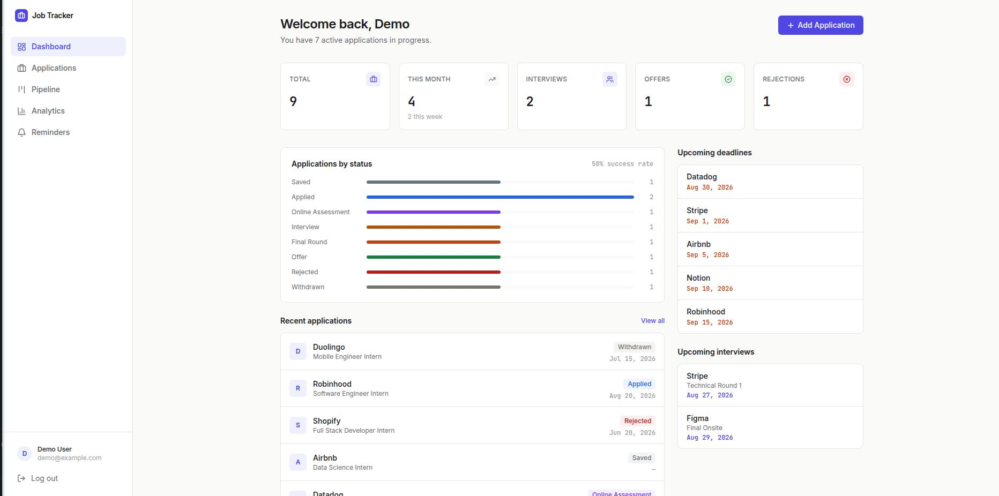

# Internship & Job Application Tracker

A full-stack web application for tracking internship and job applications — built as a portfolio project to practice production-quality patterns across a React/TypeScript frontend and a Node/Express/PostgreSQL backend.



**[Live demo →](https://job-tracker-swart-nine.vercel.app)**

*Note: the API runs on a free-tier host and may take 30–60 seconds to respond on first load if it's been idle.*

## Features

- **Dashboard** — at-a-glance stats, status breakdown, recent applications, upcoming deadlines/interviews
- **Application CRUD** — full create/edit/delete with rich metadata (company, role, location, work mode, salary, resume/cover letter used, recruiter contact, notes)
- **Search, filter, and sort** — server-side filtering by status, work mode, employment type, location, and free-text search
- **Kanban pipeline** — drag-and-drop board across 8 application stages, backed by a real status-history log
- **Application detail page** — full info, status timeline, and interview tracking in one view
- **Interview tracking** — round, type, interviewer, outcome, and meeting link per application
- **Analytics** — applications over time, status distribution, source breakdown, and conversion rates
- **Reminders** — merged chronological view of upcoming deadlines/interviews, with an overdue-item warning
- **Authentication** — JWT access + refresh tokens (httpOnly cookie), fully scoped per-user data
- **Responsive design** — usable from mobile through desktop, including a touch-friendly Kanban board

## Tech stack

**Frontend:** React, TypeScript, Vite, Tailwind CSS v4, React Router, Recharts, @dnd-kit, Sonner
**Backend:** Node.js, Express, TypeScript, Prisma ORM, PostgreSQL
**Auth:** JWT (access + refresh tokens), bcrypt password hashing

## Project structure

```
job-tracker/
├── client/ # React + Vite frontend
├── server/ # Express + Prisma backend
└── README.md
```

See `client/README.md` and `server/README.md` for setup details specific to each.

## Quick start (local development)

Prerequisites: Node.js 20+, PostgreSQL 14+, npm.

```bash
# 1. Clone and install
git clone https://github.com/navs04/job-tracker
cd job-tracker

# 2. Set up the database
createdb job_tracker

# 3. Configure the server
cd server
cp .env.example .env
# edit .env with your DATABASE_URL and JWT secrets — see server/README.md
npm install
npx prisma migrate dev
npx prisma db seed   # optional — adds demo@example.com / password123

# 4. Configure the client
cd ../client
cp .env.example .env
npm install

# 5. Run both (separate terminals)
cd server && npm run dev
cd client && npm run dev
```

Visit `http://localhost:5173`.

## Architecture notes

- **REST API**, layered as `routes → controllers → services` on the backend — routes handle HTTP wiring, controllers handle request/response shape, services own business logic and all Prisma queries.
- **Auth**: short-lived JWT access tokens (kept in memory on the client, never localStorage) + long-lived refresh tokens in an httpOnly cookie, with silent refresh-on-load and automatic retry-after-refresh on 401s.
- **Data isolation**: every query is scoped by `userId` at the database level — no user can read or modify another user's data, even by guessing IDs.
- **Status history**: every status change (manual edit or Kanban drag) is logged to a `StatusHistoryEntry` table, which powers both the application detail timeline and the analytics conversion funnel.

## License

MIT
